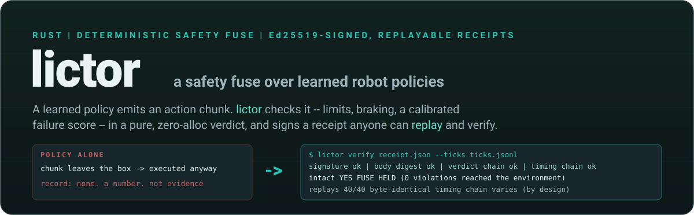

<p align="center">
  
</p>

<p align="center">
  
  <a href="https://github.com/RARS-oss/lictor/actions/workflows/ci.yml"></a>
  
  <!-- WP-13 fills this badge from `lictor bench --n 200000` (WSL2-labelled). Until then it is a placeholder, not a number. -->
  
  
  
</p>

<p align="center"><b>A deterministic safety fuse over learned robot policies: failure prediction + geometric limit enforcement + human escalation, with Ed25519-signed, hash-chained, replayable receipts.</b></p>

<p align="center">
  <a href="docs/ARCHITECTURE.md">ARCHITECTURE</a> |
  <a href="docs/EXPERIMENT.md">EXPERIMENT</a> |
  <a href="docs/REPRODUCE.md">REPRODUCE</a> |
  <a href="research/README.md">research</a>
</p>

---

## The hole

The third-party numbers first, because they are the ones that survive diligence:

- On RoboChallenge, a real-robot benchmark run by people who did not train the models, the strongest policy tested (pi0.5) averages **43.7 % success** (arXiv 2510.17950).
- Penn's in-the-wild study of pi0-FAST-DROID measured **42.3 % average task progress over 300+ trials**, lists freezing, spatial misjudgement and collisions among the failure modes, and explicitly calls for runtime monitoring and safety layers.
- RoboArena (seven institutions, 600+ double-blind paired real-robot episodes) exists because self-run evaluations misrank generalist policies. The vendor number and the field number are not the same number.

The vendor number, quoted once and with its caveat: GEN-1.5 (19.08.2026): the frontier one-shot capability its makers advertise fails ~4 times in 10 (59 % +- 10 %, self-reported, unverified) on simple short-horizon tasks -- and it is closed-weights, partnership-only, from makers who say they cannot explain why it works.

The tooling side is thinner than the model side. Every published VLA failure detector (SAFE, FAIL-Detect, Sentinel, FIPER, ActProbe, VLA-FAIL and the 2026 wave) is research Python that ships a score, not a runtime. The one policy-agnostic runtime safety product that shipped, 3Laws Supervisor, was acquired in May 2026 and taken off-market. NVIDIA Halos is silicon-locked infrastructure that does not wrap policies. LeRobot's official safety story is a Python `torch.clamp`: an `EEBoundsAndSafety` clipping step in the processor pipeline plus a joint-limit discovery script.

What is missing is small and specific: an independent, hardware-agnostic, deterministic runtime that sits at the policy-serving boundary, predicts failure from the action chunks the policy already emits, enforces geometric and kinematic limits with a checked braking condition, escalates to a human when it cannot resolve the situation itself, and signs every decision so that someone who was not in the room can check it later. That is lictor.

## What it is

**Two planes, one byte stream.** The best-effort plane (Python: lerobot 0.6.1, torch, gym_pusht) may allocate, block on a GPU, page-fault and be nondeterministic across machines. The fuse plane (`lictor serve`, Rust 2021, `panic = "abort"`, `no_std` core) receives one NDJSON line per control tick on stdin and answers with one verdict on stdout. `decide()` is a pure function of `(state, config, calibration, input)`: no allocation, no clock, no lock, no syscall, fixed iteration bounds, `f64` arithmetic restricted to `+ - * / sqrt min max abs` so that the verdict is bit-identical on the tested target. The host executes `verdict.action` verbatim; its default output for a tick is `clamp_box(current position)`, and only a verdict that arrives replaces it. A late verdict costs liveness, never safety.

**Three pillars, in the order they run inside every tick.**

1. **Tier 0 -- geometric and kinematic enforcement.** Workspace box, commanded speed, acceleration, jerk, reach (teleport guard) and an optional contact check over the whole delivered chunk, corrected by a direction-preserving projection (the leash) when the envelope says `clamp_mode = "project"`. Brake feasibility is the checked stopping condition: an exact forward rollout of the committed prefix plus a braking manoeuvre through the environment's own second-order PD dynamics (at most 160 substeps of `+ - *`), from the simulator's own velocity. Limits are fitted from data (`lictor envelope fit`: empirical p99.9 x 1.25 over calibration successes, then a McNemar parity gate) -- hand-picked limits are decorative or dishonest.
2. **Tier 1 -- failure prediction from the action stream.** Eight black-box features that cost microseconds and need no extra policy pass: temporal consistency error and its velocity-normalised twin (ActProbe / VLA-FAIL lineage), negated chunk magnitude, normalised jerk ratio, soft reach, path inefficiency, stall and speed peak, plus four `ext` slots for white-box sidecar scores. Each is robustly standardised per time bin, aggregated through a fixed-order DNF gate, compared with a split-conformal threshold `tau` at a declared `alpha`, and windowed K-of-N. The threshold is a file with a digest, not a heuristic.
3. **Escalation -- a state machine with a human at the end.** `Armed -> Watching -> Clamped -> Braking -> Held -> Escalated`, each transition a row in a fixture-tested table. `Held` re-arms itself only under a budget; `Escalated` emits a `HandoffRecord` with a one-sentence `reason_text` and waits for an Ed25519 `AckToken` from an operator key listed in the signed envelope. `Fault` is the fail-closed latch for non-finite input, schema or continuity violations and watchdog misses: hold action for the rest of the episode, no re-arm.

**Receipts.** Every tick folds into two sha256 chains: the verdict chain over exactly what a replay reproduces, and the timing chain over the wall-clock that it honestly does not. Every episode gets one Ed25519 signature over an RFC 8785 canonical, float-free body that binds the envelope, the calibration, the host's declared bindings, every count, both chain heads and the previous ledger entry. `lictor verify` and the stdlib-only `adapters/verify_receipt.py` check the same bytes; `lictor curve` recomputes every reported metric from receipts alone and refuses a broken ledger. The trust model in one sentence: receipts bind the host's declarations and defend against edits by anyone without the key. The long form -- what the fuse verifies itself versus what the host declares and the fuse signs by proxy -- is [SECURITY.md](SECURITY.md).

## See it in 30 seconds

```bash
export CARGO_TARGET_DIR=/mnt/d/lictor/target      # C: is full on the dev machine; any writable directory works elsewhere
cargo build --release -p lictor-cli
bash scripts/demo.sh
```

The demo replays a recorded PushT episode through the fuse, signs the receipt with the committed test key, verifies it, and then tampers with it three ways: edit one byte of the signed body and the signature fails; edit one tick in the 300-line ticks file and `verify --ticks` reports the break; re-chain it and the head no longer matches.

The block below is the frozen reference shape of that output (`docs/ARCHITECTURE.md` sec 9 -- CI greps these strings). **It is not a paste.** WP-13 replaces it with the real output of `scripts/demo.sh` on this machine; every `...` and every count is a placeholder until then.

```
$ lictor verify demo/receipts/000007.json --ticks demo/ticks/000007.jsonl --pubkey <test pubkey>
  schema         ok    lictor-receipt/v1
  signature      ok    (key ...)
  pubkey         ok    (matches --pubkey)
  body digest    ok    ...
  envelope       ok    digest recomputed ...  embodiment ...
  counts         ok    ticks=300 verdict_events=300 timing_events=300 steps=300
  verdict chain  ok    head=...  (300 ticks)
  timing chain   ok    head=...  (not replayable -- by design)
  intact         YES
  FUSE HELD      (... substitutions, 0 violations reached the environment)
  WARNING: signed with the committed test key

$ lictor verify demo/tampered.json                 # one byte of the signed body changed
  signature      FAIL  (key ...)
  body digest    FAIL  ...
  intact         NO

$ lictor verify demo/receipts/000007.json --ticks demo/edited.jsonl        # one tick edited
  verdict chain  BROKEN at seq=17

$ lictor verify demo/receipts/000007.json --ticks demo/rechained.jsonl     # hashes 17..299 recomputed: the chain links, the head does not
  verdict chain  HEAD MISMATCH recomputed=... signed=...
  intact         NO

$ python3 adapters/verify_receipt.py demo/receipts/000007.json --ticks demo/ticks/000007.jsonl --pubkey <test pubkey>
OK ...
```

A whitespace edit of the pretty-printed receipt changes nothing, by design: canonical bytes are recomputed from the parsed structure, never trusted from disk.

## Results

Every number in this section is **TBD after the pilot**. Nothing here is estimated; the figures are produced by `harness/figures.py` from `results/<run>/curve/summary.csv`, which `lictor curve` writes from signed receipts only. The pilot is 220 episodes (`calib-obs` x 100, `obs-d0` x 60, `t01-a05-d0` x 60); its single closed-loop point is drawn hollow and labelled pilot everywhere, and no headline number is ever taken from it.

<p align="center">
  
</p>

*Figure 1 -- flagged / averted / false-trip rates (top), task success for `t01-a05-d*`, `t0-d*` and the fuse-off latency control `obs-d*` (middle), intervention and escalation rate (bottom), all as functions of `d` injected control steps of staleness. 100 ms per step on PushT; the second top axis re-scales to a 20 ms clock and is a re-scaling, not a measurement. Sync solid, async dashed. Hollow points are pilot points (n < 100) and never carry a line. sync d >= 7 has no chunk overlap; tce/acc are invalid there and the per-d valid fraction (`tce_valid_frac`) is shown as the thin bar under the top panel. The inset is the `decide_ns` histogram, measured under WSL2 virtualisation (Hyper-V utility VM, non-RT host) -- not a real-time environment.*

<p align="center">
  
</p>

*Figure 5 -- `decide_ns` HdrHistogram on a log axis with p50 / p99 / p99.9 / p99.99 / max annotated, `io_ns` (the pipe round trip, reported separately and larger than the verdict itself) beside it, and the cyclictest environment baseline. Measured under WSL2 virtualisation (Hyper-V utility VM, non-RT host) -- not a real-time environment. The same binary on PREEMPT_RT with `mlockall` + `SCHED_FIFO` + `isolcpus` is expected in the 50-200 us class; that is a conditional expectation, not a measurement.*

| point | n | success [95 % CI] | delta vs `obs-d0` | delta vs latency control | flagged | false trips | `tce_valid_frac` |
|---|---|---|---|---|---|---|---|
| `obs-d0` (fuse off) | TBD after the pilot | TBD | -- | -- | -- | -- | -- |
| `t0-d0` (Tier 0 only; parity gate) | TBD after the pilot | TBD | TBD (McNemar p TBD) | -- | -- | TBD | -- |
| `t01-a05-d0` (headline, pilot point) | TBD after the pilot | TBD | TBD | -- | TBD | TBD | TBD |
| `t01-a05-d{1,2,3,5,8}` (the curve) | TBD after the overnight run | TBD | TBD | TBD | TBD | TBD | TBD |
| `inj-obs-d0` vs `inj-t0-d0` (enforcement demo) | TBD | -- | -- | -- | -- | -- | `violations_reached_env` TBD vs TBD |

The published baseline for `lerobot/diffusion_pusht` is 65.4 % over 500 episodes. It was published under older pins than the ones installed here (gym-pusht 0.1.6, gymnasium 1.3.0, pymunk 6.11.1); the `obs-d0` x 500 run is the reproduction and the result is reported whichever way it comes out.

## The honest boundary

What lictor cannot catch, stated before anyone asks:

1. **Semantic task failure inside the geometric envelope.** On PushT the natural failures are semantic -- the block does not reach the goal -- and happen entirely inside a legal workspace. Tier 0 is a guard, not the main event; its targets are (a) zero violations reaching the environment under injected action spikes and (b) no measurable success cost once the envelope is fitted at empirical p99.9 x 1.25 (McNemar p > 0.05); both are measured and reported whichever way they come out. The predictive tier carries the curve.
2. **Conformal guarantees are conditional.** alpha bounds the episode-level false-alarm rate only under exchangeability with the calibration pool -- this policy, this task, this distribution. A shift breaks it. With K-of-N, alpha is a conservative upper bound; we report the empirical held-out rate beside it.
3. **Perception-assisted checks (`contact`, any `cov_stall` ext channel) use privileged simulator state** and are off by default; when shown they are a separate, labelled line.
4. **The braking model is contact-free.** Contact only decelerates the agent in PushT, so the prediction is conservative for the box constraint -- a modelling assumption, not a proof. The rollout starts from the simulator's own velocity (`info["vel_agent"]`); an embodiment without a velocity signal falls back to a finite difference, which is recorded in the receipt and makes the rollout approximate.
5. **WSL2 measurements are not real-time measurements.** Algorithmic determinism, zero allocations, fixed iteration bounds and byte-identical replay (on the tested target) are verifiable properties. Latency histograms are statistics under virtualisation and every one of them carries the WSL2 label. The d-axis is simulated time and therefore virtualisation-independent. lictor never says "safety-rated", "hard real-time" (any spelling), "certified", "engineered to ... principles", or implies a PL/SIL rating; it claims algorithmic determinism, a bounded-by-construction hot path and measured latency histograms. It borrows two design ideas from the functional-safety literature -- fail-closed defaults and a bounded, deterministic decision path -- and claims no conformance to IEC 61508, ISO 13849 or ISO 10218; the SS1/SS2/STO/monitored-standstill words are used for readability only.
6. **The receipt is evidence against outsiders, not against the experimenter.** The fuse verifies mode, dims, digests, its own hash and every tick; everything in `binding`, `run`, `budget.delay_steps`, `fault_injection`, `inputs` and `outcome.success` is the host's signed-by-proxy declaration, and the key-holder can rebuild and re-sign a ledger. Truncation of a DECLARED pool is detected by `lictor curve`; an external witness (Rekor / RFC 3161) is what would bind the experimenter and is roadmap.
7. **65.4 % is the published PushT number.** We re-measure it with our pins and report what we get.
8. **Tier 1 is a detector we ported (TCE / ACC / ACM / NJR / path efficiency / stall), not one we invented.** The contribution is the deterministic, replayable, signed decision plane and the honest budget-to-safety curve.
9. **Sensors that lie and a calibration set contaminated with failures** defeat the predictive tier; the receipt records the calibration pool and its success labels so the contamination is at least auditable.
10. **The IPC round trip (tens of us) is larger than the verdict itself.** Both numbers are reported; neither is hidden in the other.

## Determinism

sbx's rule carries over unchanged: determinism is the precondition, not decoration. A verdict that cannot be replayed cannot be audited, so the decision path forbids `f32`, `mul_add`, transcendentals, `HashMap` iteration, SIMD reductions, clocks, RNG and allocation, sums are accumulated in a fixed order, and every non-finite input is a fault. The evidence is a replay, not an argument:

```
$ lictor replay --repeat 40 bench/fixtures/traces/pusht_000007.ndjson --envelope envelopes/pusht.toml --calibration bench/fixtures/calibration.a05.json --mode enforce
  ticks=300  repeats=40
  replays 40/40 byte-identical  verdict_chain=<TBD: WP-13 pastes the measured head>
  timing chain head varies (by design -- wall-clock is not replayed)
  states nominal=TBD watching=TBD clamped=TBD braking=TBD held=TBD escalated=TBD fault=TBD
  RESULT  DETERMINISTIC
```

Forty replays on one machine are determinism evidence on the tested target (x86_64 SSE2, release and debug builds), not a proof and not a claim about other platforms; on any target where Rust `f64` is strict binary64 with no extended-precision intermediates and no FMA contraction the same bytes are expected, and untested. The timing chain head varies (by design): wall-clock is signed so it cannot be edited later, and excluded from replay so that it cannot be mistaken for something reproducible. `crates/lictor-fuse/tests/alloc.rs` counts allocations inside `decide()` with a gated global allocator and asserts zero; `lictor bench` prints the same count next to the WSL2-labelled histogram.

## Build, test, run

Everything Rust runs under WSL2 on the dev machine (cargo 1.98 stable). Drive C: is full, so `CARGO_TARGET_DIR` is mandatory and the Makefile refuses to run without it.

```bash
export PATH="$HOME/.cargo/bin:$PATH"
export CARGO_TARGET_DIR=/mnt/d/lictor/target
cargo fmt --all --check && cargo clippy --workspace --all-targets -- -D warnings && cargo test --workspace
make nostd-check                                   # lictor-core / -detect / -fuse without std
cargo build --release -p lictor-cli
$CARGO_TARGET_DIR/release/lictor selftest          # one line per check, "SELFTEST PASS"
$CARGO_TARGET_DIR/release/lictor bench --n 200000  # "allocations   0" + the WSL2-labelled histogram
bash bench/run_all.sh $CARGO_TARGET_DIR/release/lictor
```

Python (lerobot 0.6.1, torch 2.7.1+cu126, fp32 on a GTX 1060 3GB; CPU fallback works but is unusable for experiment arms) lives in a venv on D:; `harness/env.sh` exports every pin and determinism variable. The migrated checkpoint (`lerobot/diffusion_pusht` needs lerobot's normalisation migration on 0.6.1) is produced once by `harness/migrate_checkpoint.py`. The full recipe is [docs/REPRODUCE.md](docs/REPRODUCE.md).

```bash
source harness/env.sh
python harness/microbench.py --out $LICTOR_RESULTS/mb                    # the day-0 gate: PASS lines or nothing else runs
python harness/run.py --plan --budget-min 60 --run-id pilot ...           # projected wall-clock; refuses over-budget steps
python harness/run.py --run-id pilot --arms calib-obs --seeds 900000-900099 --out $LICTOR_RESULTS --envelope envelopes/pusht.base.toml
```

The `lictor` binary (every command accepts `--json`; exit codes `0` ok, `1` verification failed / fuse not held / determinism mismatch, `2` usage, `3` internal):

| command | does |
|---|---|
| `serve` | the NDJSON fuse server (`lictor-wire/v1`) on stdin/stdout; one child per harness worker |
| `verify` | verify a receipt (+ `--ticks`, `--timing`, `--ledger`, `--curve`, `--calibration`, `--pubkey`); prints the aligned block above |
| `replay` | re-feed a recorded trace `--repeat N` times and compare the verdict-chain head |
| `calibrate` | split-conformal calibration from observe-mode traces -> `calibration.<alpha>.json` |
| `envelope` | `init`, `check`, `digest`, `show`, `fit` (empirical limits + `[fit]` record; `--operator` for the oracle envelope) |
| `sweep` | Layer A: TPR / FPR / lead time / ROC-AUC / AUCPDT for every alpha x detector, offline |
| `curve` | Layer B: every metric recomputed from signed receipts, with both deltas, bootstrap CIs and McNemar; refuses broken ledgers |
| `ledger` | `verify` / `append` the per-arm hash chain |
| `key` | `init` / `pub`; refuses the repo and `/mnt/[a-z]/`; prints the custody line |
| `ack` | sign an `AckToken` (resume / abort / retune) against a handoff digest |
| `history` | the run memory (`history.jsonl`) and its streak signals |
| `crash-receipt` | host-side accounting for a fuse child that died: a signed `fuse_crash` receipt, counted as a failure |
| `bench` | the latency histogram, per-tier lines, `allocations   0`, the arena size and the WSL2 sentence |
| `selftest` | fixture checks including the four tamper vectors |
| `version` | `lictor 0.1.0 (<git>) sha256=<binary>` |

## Repository layout

| path | contents |
|---|---|
| `crates/lictor-core` | frozen types: `fmath`, the chunk IR, `SafetyEnvelope` (TOML, validate, compile, digests), scores, verdict, state, the reason glossary, ack types; `no_std` |
| `crates/lictor-detect` | Tier 0 (limits + projection), brake feasibility, K-of-N window, Tier-1 features, the conformal runtime rule; `no_std` |
| `crates/lictor-fuse` | `decide()`, the transition table, the tally; `no_std` |
| `crates/lictor-canon` | RFC 8785 JCS over the float-free profile, digests |
| `crates/lictor-receipt` | tick and timing chains, receipt body and signing, ledger, curve receipts, handoff and ack verification, history, keys |
| `crates/lictor-runtime` | wire payloads and codec, the session, the episode writer, the latency histogram, trace files |
| `crates/lictor-calib` | calibration files, trace loading, split-CP, envelope fit, metrics, sweep, curve |
| `crates/lictor-cli` | the `lictor` binary |
| `harness/` | the PushT harness: lerobot compat and checkpoint migration, the `n_action_steps = 15` override, the executor with delay injection, arms, the paired-seed runner, fault injection, the microbench, analysis and figures |
| `adapters/` | `lictor_client.py` (the wire client), `verify_receipt.py` (stdlib-only verifier), `lerobot/` and `openpi/` (roadmap stubs, labelled UNVERIFIED) |
| `bench/` | reproducible vectors: latency, determinism, tamper, workspace breach, brake, failure prediction |
| `envelopes/` | `pusht.base.toml` (placeholders), `pusht.toml` (fitted), `pusht.oracle.toml` (fitted + the demo operator key) |
| `docs/` | [ARCHITECTURE](docs/ARCHITECTURE.md), [ANALYSIS](docs/ANALYSIS.md), [IMPLEMENTATION_PLAN](docs/IMPLEMENTATION_PLAN.md), [VERIFIED_FACTS](docs/VERIFIED_FACTS.md), [verdict-schema](docs/verdict-schema.md), [envelope-schema](docs/envelope-schema.md), [receipt-schema](docs/receipt-schema.md), [wire-protocol](docs/wire-protocol.md), [calibration](docs/calibration.md), [EXPERIMENT](docs/EXPERIMENT.md), [REPRODUCE](docs/REPRODUCE.md), `figures/` |
| `research/` | one memo per cited number, indexed in [research/README.md](research/README.md); `day0-smoke/` holds the raw day-0 measurements |

## What this machine can do (measured, 2026-08-31)

These are the day-0 measurements behind the pilot sizing (`docs/VERIFIED_FACTS.md`, raw logs under `research/day0-smoke/`). They size the experiment; they are not results.

| what | measured | log |
|---|---|---|
| `import lerobot, torch` from the DrvFs venv | 12-16 s | `smoke.log` |
| policy load from the migrated checkpoint | 8.3 s | `smoke.log` |
| one 300-step PushT episode, single env (B=1), seed 0, stock config | 153.9 s wall; 44 chunk inferences, mean 3462 ms, max 6278 ms; `select_action` median 0.10 ms | `smoke.log` |
| denoiser cost per env-chunk vs batch size (100 DDPM steps, fp32) | B=1: 2843 ms, B=8: 376 ms, B=32: 123 ms; peak VRAM 2179-2387 MiB | `bench_batch.log` |
| the `n_action_steps = 15` overlap trick | 15-row chunk delivered; the executed 8-row prefix is bitwise identical to the stock 8-row chunk (max diff 0.0) | `bench_batch.log` |
| published reference | 65.4 % over 500 episodes; 1.46 s/episode is lerobot's batched eval on the reference GPU, not a single-env figure | `eval_info.json` |

The plan's pre-measurement expectation of 12-20 s per episode at B=1 was wrong by roughly 8x. Everything downstream scales off the measurement: `harness/run.py --plan --budget-min` prints the projected wall-clock before running anything and refuses a step that does not fit. The large throughput lever (batching environments through one policy forward) is in tension with per-episode seeding of the diffusion sampler; the resolution is recorded in `docs/VERIFIED_FACTS.md` and the work-package reports and is not decided in this README.

## Roadmap

Value-first; nothing below changes `lictor-core`, `lictor-detect`, `lictor-fuse`, the receipt schema or the wire schema -- only a new manifest, envelope and adapter.

1. **PushT + diffusion policy** (this milestone): the curve, the receipts, the tamper demo.
2. **ALOHA sim + ACT**: `ActionKind::JointPosition`, `action_dim=14`, box = joint limits, `BrakeKind::JerkLimited`; a non-VLA policy class; `envelopes/aloha.toml` + `harness/aloha_rollout.py`.
3. **LIBERO + `lerobot/smolvla_libero`** via `adapters/lerobot/lictor_lerobot.py` (`LictorStep`, a v0.6 `env_postprocessor` ProcessorStep -- the slot whose docs show a `torch.clamp` safety example); `action_dim=7`, `control_hz=20`, `horizon=50`, `exec=25`; the first policy whose per-suite success is unpublished and must be measured; 20 Hz makes the budget axis bite. Shipped as an importable, clearly-labelled UNVERIFIED stub in milestone 1.
4. **openpi websocket proxy** (`adapters/openpi/lictor_proxy.py`, then a Rust `lictor proxy --upstream ws://host:8000`): pi0.5 on a rented 4090 with WAN latency as a controlled variable; msgpack in, same chunk IR, same NDJSON internally. Shipped as an importable UNVERIFIED stub in milestone 1.
5. **Tier-2 sidecar contract**: `ext0..ext3` are already plumbed; a patched `BasePolicy` attaches logpZO / RND / SAFE-probe scalars and the mask flips on.
6. **`RearmPolicy::AckOnly` operator tooling**: `lictor ack` exists; a real operator console is roadmap.
7. **Logger thread over a preallocated SPSC ring** (chain folding off the I/O thread) for high-rate embodiments.
8. **Native Linux / PREEMPT_RT histograms** (mlockall + SCHED_FIFO + isolcpus): the credible worst-case latency claim; the same binary is expected in the 50-200 us class -- stated conditionally, not measured here.
9. **`no_std` MCU fuse**: `lictor-core`/`-detect`/`-fuse` compile without std today (libm sqrt fallback); the cheapest path to a bounded-latency measurement on a bare-metal target later.
10. **External witness (Rekor / RFC 3161)**: closes the ledger tail-truncation gap.
11. **`lictor-zk`**: Bulletproofs range proof that a commanded action was inside the signed envelope limits without revealing it (bulla-zk lineage, isolated dalek-ng fork).
12. **cu29-task / dora-node wrappers**: distribution channels into Copper-rs and dora-rs.

Language that is never used, anywhere, by anyone on this project as a claim about lictor: "safety-rated", "hard real-time" / "hard-real-time", "PL d", "SIL 2", "certified", "engineered to <standard>", "<standard> principles", "certified limits", and any "-like"/"-style" reference to a standard's clause without the disclaimer "terms borrowed for readability; no conformance is claimed or tested". [CONTRIBUTING.md](CONTRIBUTING.md) carries the grep that enforces it.

## Authorship

lictor was designed and implemented by Claude (Claude Fable 5.1, working through Claude Code) under the direction of RARS-oss, who set the problem, the constraints, the experiment, the hardware and the editorial rules, and who reviews every number before it is claimed. The design was frozen after two independent critical reviews; what changed and what was rebutted is recorded in `docs/IMPLEMENTATION_PLAN.md` PART G. The receipt machinery (Ed25519 over canonical bytes, hash-chained ledgers, the tamper demo), the typed verdict model with its diff and streak semantics, the deterministic capped rendering and the house style all descend from the author's [bulla](https://github.com/RARS-oss/bulla) and [sbx](https://github.com/RARS-oss/sbx). The Tier-1 features are ported from the published detectors named in the honest boundary; the sources behind every cited number are indexed in [research/README.md](research/README.md).

## License

MIT. See [LICENSE](LICENSE).
